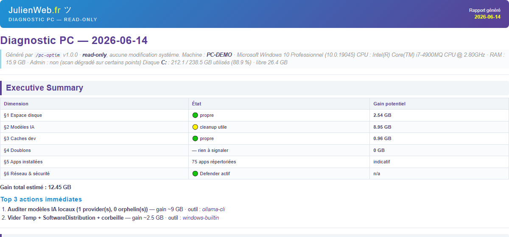

<h1 align="center">pc-optim</h1>

<p align="center">
  <b>Diagnostic read-only de ton PC Windows, piloté par l'IA.</b><br>
  <i>L'agent regarde, mesure et te dit où aller — il ne supprime jamais rien.</i>
</p>

<p align="center">
  <a href="LICENSE"></a>
  
  
  
</p>

---

`pc-optim` est un **skill [Claude Code](https://claude.com/claude-code)** qui ausculte une machine Windows en **lecture seule** et produit un rapport (Markdown + PDF) : où est le poids sur ton disque, quels modèles d'IA et caches de dev ont grossi, quels doublons traînent, et l'état réseau/sécurité. Chaque constat est relié à l'outil qu'il faut dégainer pour le traiter.

> 🔒 **Garantie read-only.** Aucun `Set-`, `New-Item`, `Remove-`, `Add-` système dans les scripts. Aucune modification du registre, des services, des droits ou des fichiers — hors le dossier de sortie du rapport. Tu diagnostiques, **tu** décides.

## Ce que ça scanne (6 examens)

| # | Cible | Exemples |
|---|---|---|
| 1 | **Disque `C:\`** | gros dossiers, temp système, archives oubliées |
| 2 | **Modèles d'IA locaux** | Ollama, Hugging Face, LM Studio, Stable Diffusion, ComfyUI |
| 3 | **Caches de dev** | npm, pip, cargo, go, Maven, Docker, IDE |
| 4 | **Doublons** | Downloads / Documents / Desktop / Pictures / Videos |
| 5 | **Applications** | registry + winget + Appx + dernière utilisation |
| 6 | **Réseau & sécurité** | DNS, VPN, ports en écoute, Windows Defender, pare-feu |

## Démarrage rapide

Prérequis : Windows 10/11, Git Bash (MSYS), PowerShell. `node` optionnel (export PDF), `winget` optionnel (mises à jour).

```bash
git clone https://github.com/molokoloco/pc-optim.git
mkdir -p ~/diagnostics-pc && cd ~/diagnostics-pc
SKIP_UPGRADE=1 bash ~/pc-optim/pc-optim.sh
# → pc-optim-YYYY-MM-DD.md  (rapport)
# → pc-optim-YYYY-MM-DD.pdf (PDF mis en page)
# → pc-optim-out/           (6 JSON + logs)
```

Flags : `SKIP_DISK SKIP_AI SKIP_DEV SKIP_DUP SKIP_APP SKIP_NET` (sauter un scan), `SKIP_PDF SKIP_UPGRADE SKIP_OPEN`, `PC_OPTIM_TOPN=100`, `PC_OPTIM_FOLDER_TIMEOUT=600` (timeout de mesure par dossier, défaut 240 s — à monter sur un profil chargé).

## Exemple de sortie (extrait réel)

```
Disque C: : 227.8 / 238.5 GB utilisés (95.5 %) · libre 10.7 GB

| Dimension        | État              | Gain potentiel |
|------------------|-------------------|----------------|
| §1 Espace disque | 🟢 propre         | 3.43 GB        |
| §2 Modèles IA    | 🟡 cleanup utile  | 12.5 GB        |
| §3 Caches dev    | 🟢 propre         | 0.96 GB        |

Gain total estimé : 16.89 GB
```

Chaque ligne porte un **code de risque** — 🟢 vide sans risque · 🟡 vérifie d'abord · 🔴 prudence — et l'**outil recommandé** (SpaceSniffer, CCleaner, 7-Zip, WingetUI, Memory Cleaner, utilitaire fabricant…).

[](examples/example-report.png)

> 📄 Rapport d'exemple complet (anonymisé) : **[examples/example-report.md](examples/example-report.md)**

## Pourquoi pas de hash sur les doublons ?

Un hash récursif sur un home Windows = 20-90 min. Pour 99 % des doublons utiles, comparer `(nom, taille)` suffit et c'est instantané. Le rapport remonte des **candidats** ; pour certifier avant suppression, passe [dupeGuru](https://dupeguru.voltaicideas.net/) ou AllDup sur le dossier identifié.

## Forkable Linux/macOS

Remplace les `.ps1` par leurs équivalents (`du -ah`, `find -size +`, `ss -tln`, `resolvectl status`), adapte `templates/tools-mapping.json` aux outils Unix (BleachBit, ncdu, fdupes). Le wrapper, le template et le pipeline JSON restent identiques.

## Documentation

- [SKILL.md](SKILL.md) — doc complète, trigger `/pc-optim`
- [howto-execution-policy.md](howto-execution-policy.md) — exécuter du PowerShell sans modifier la policy
- [howto-defender-exclusions.md](howto-defender-exclusions.md) — pourquoi on ne touche pas aux exclusions
- [CHANGELOG.md](CHANGELOG.md)

## À lire

- 📝 **L'histoire derrière l'outil** : [J'ai transformé mon guide d'optimisation Windows en agent IA](https://julienweb.fr/cours-formations/pc-optim-diagnostic-windows-ia-claude-code/10803/) — Julienweb.fr
- 🧹 **Le guide manuel hub** : [Nettoyer, optimiser et mettre à jour votre Windows 10/11](https://julienweb.fr/cours-formations/nettoyer-optimiser-et-mettre-a-jour-votre-windows-10-11/3354/)

## Licence

[MIT](LICENSE) © 2026 Julien Guézennec — [Julienweb.fr](https://julienweb.fr)
